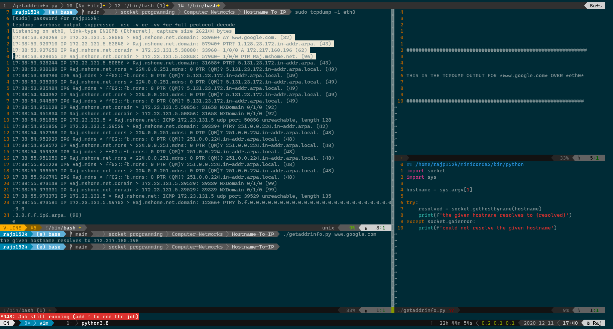
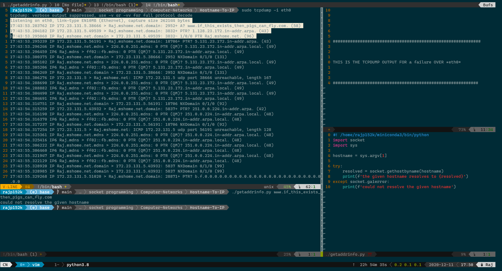

# Host Name Resolution

## Computer Networks

### Thu Dec 17 20:03:11 IST 2020

Here, a simple program takes in a host name to be resolved and returns the ip address if it able to do so.

The screen shots attached display a success as well as a failure.

Note the attached tcpdump output as well in the case of a succesful and an unsuccesful resolution.

### References

 - tcpdump man page
