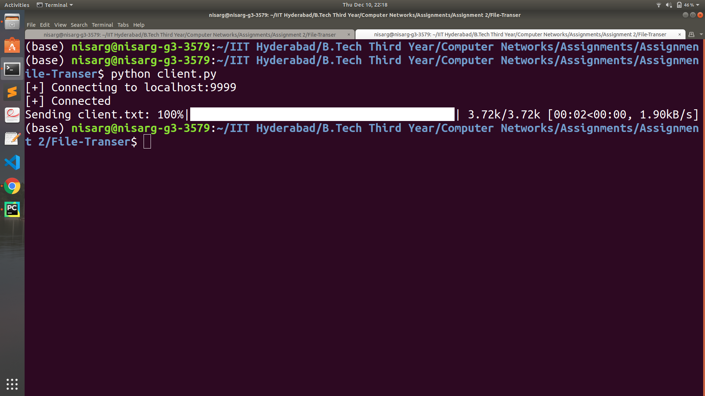

Download server.py and client.py file.
 
Run server.py in the terminal.
 
Now, make a file client.txt that you want to transfer from client to server.
 
Then run client.py.
 
After successful transfer, you will find server.txt file which is same as client.txt but generated by server.
 
Note: I have added sleep(0.5) after each 1024 Byte transfer for better understanding. Remove this sleep if files are large.

### Server Screen Shot

 

### Client Screen Shot

 

