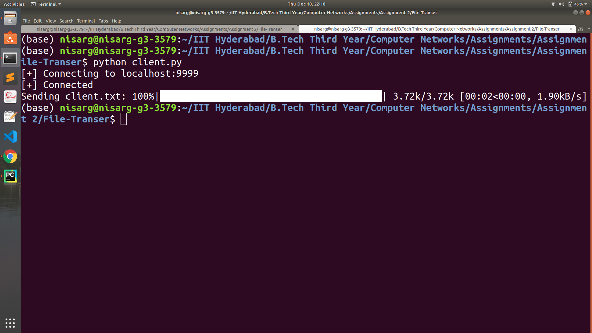
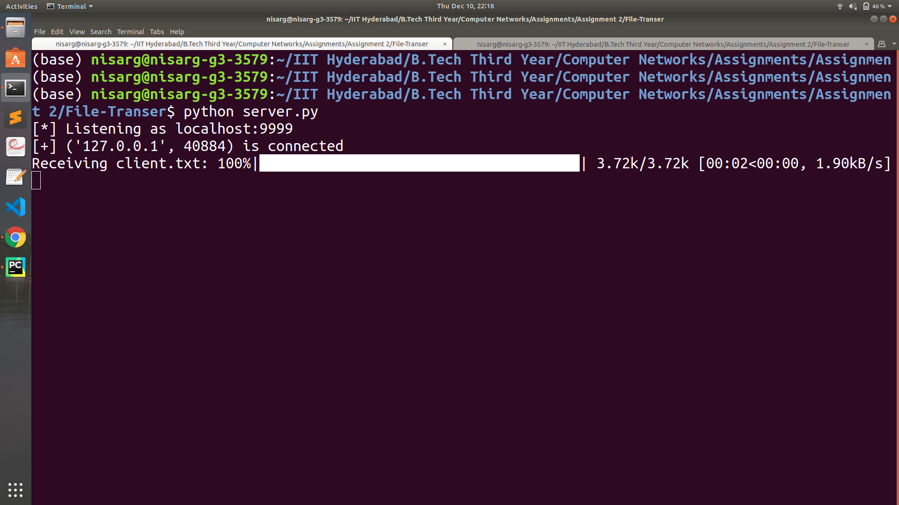

# File Transfer

## Computer Networks

### Thu Dec 17 19:57:42 IST 2020

 This is a basic display of socket programming in python.

  - We transfer a file from a client to a server in chunks of 1KB.
  - We use the IPv4 protocol over the loopback interface port 9999

These are the console outputs for the client and the server respectively.

We've deliberately delayed the transmission by adding half-second sleeps to make the chunked transfer more observable

Consider commenting the delay when testing larger files

