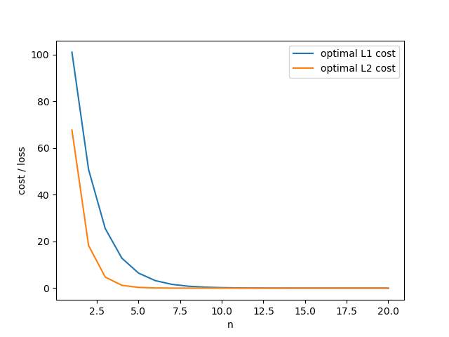

#  RAJ PATIL
##  CS18BTECH11039 
##  Convex Optimization : Lab 4.2 

---

## Observations

 - for both L1 and L2 loss : 
    - the loss decreases as the order of the polynomial (n) increases
    - the loss increases as the resolution of the objective (N) is inreased
 - for plotting proceeding with N=100 and plotting all from n = 1 to n = 20

---

## Answers

Both parts have been answered together

## A,B,C : run code appended in the submission

---

## D

